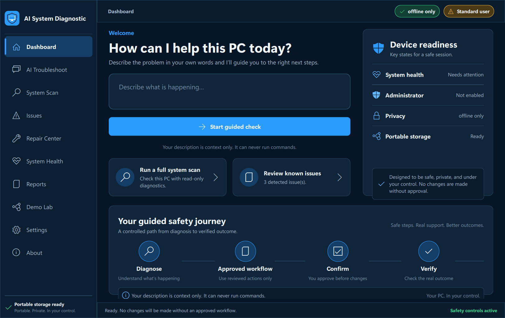

# AI System Diagnostic

Portable, evidence-driven Windows troubleshooting with controlled repair workflows.

AI System Diagnostic is a Windows-first desktop application that collects real diagnostic evidence, detects supported problems with deterministic rules, selects only registered repair workflows, verifies outcomes, and exports sanitized evidence reports. It is designed to run from a writable USB folder without a traditional installer.



## Problem and target users

Windows troubleshooting is often manual, inconsistent, and difficult to audit. AI System Diagnostic gives technical-support learners, desktop-support technicians, and individual Windows users a structured path from evidence collection to a verified outcome. It does not replace professional judgment and does not silently make system changes.

## Troubleshooting workflow

```text
Describe or select a problem
        ↓
Run read-only diagnostics
        ↓
Apply deterministic detection rules
        ↓
Select an Approved Fix Registry workflow
        ↓
Request confirmation/elevation when required
        ↓
Capture before/after evidence and verify the result
        ↓
Report verified, partial, failed, or escalated outcome
```

## Current implementation

The application includes:

- A PySide6 and Qt Quick desktop interface with Dashboard, AI Troubleshoot, System Scan, Issues, Repair Center, System Health, Reports, Demo Lab, Settings, and About areas.
- Real Windows diagnostics for system information, CPU and memory, disks, networking, important services, printers, and device status where Windows exposes the data.
- Deterministic offline problem detection for performance, disk, network, DNS, IP, adapter, printer, service, and device issues.
- A controlled Approved Fix Registry. Neither AI output nor user text can execute arbitrary PowerShell, CMD, Python, or shell commands.
- Real before/after snapshots, deterministic verification, bounded approved fallbacks, escalation, and SQLite audit history.
- Conversational symptom intake that uses user text only as troubleshooting context.
- Sanitized PDF, CSV, and JSON exports generated from persisted SQLite evidence.
- A fully isolated Demo Lab for safe portfolio demonstrations.
- A retained legacy Tkinter interface available with `--legacy-ui` during migration.

The application does not silently run destructive operations. Workflows that need confirmation or administrator elevation remain gated. A repair is shown as Resolved only when its verification evidence confirms that result.

## Requirements

- Windows 10 or Windows 11
- Python 3.11 or newer for source development
- No Node.js or npm is required
- Administrator access is optional for scans; some approved repairs require elevation

Install dependencies:

```powershell
python -m pip install -r requirements.txt
```

Start the desktop app:

```powershell
python main.py
```

Start the retained legacy UI:

```powershell
python main.py --legacy-ui
```

## How to use the app

1. Open **Dashboard** and select **Start Full System Scan**.
2. Follow progress in **System Scan**. A collector that cannot run is displayed as **Not Run**, not as a healthy result.
3. Review detected problems in **Issues**, including severity, evidence, risk, required elevation, and the approved workflow recommendation.
4. Use **Repair Center** to inspect the selected workflow. Confirm higher-risk or disruptive actions when prompted.
5. Review the before/after evidence and final verified outcome.
6. Export diagnostic, session, repair, or escalation evidence from **Reports**.

For a symptom-led flow, open **AI Troubleshoot**, describe the problem with useful detail, answer the follow-up question, and let the app choose relevant approved diagnostics. A vague answer such as “yes” is intentionally not treated as sufficient evidence.

## Privacy and AI modes

The Settings screen provides three modes:

- `offline_only`: local classification, diagnostics, rules, and knowledge only.
- `hybrid_ai`: a configured provider may analyze a sanitized evidence envelope, but every suggested workflow is validated against the Approved Fix Registry.
- `ai_disabled`: disables AI-provider reasoning while keeping direct scans and deterministic tools available.

Provider credentials are accepted only through environment configuration and are never written to SQLite, logs, reports, or the portable settings file. This repository contains the provider interface and an unavailable-provider fallback; it does not ship a configured external AI service.

The optional environment variables use the `AISD_` prefix. See `.env.example` for the complete list.

## Diagnostic coverage

The full scan collects only available fields:

- Windows version, computer name, processor, RAM, disks, and uptime
- CPU and memory utilization plus high-usage processes
- Drive capacity and basic disk indicators
- Adapters, enabled state, IP, gateway, DNS, connectivity, DNS resolution, and gateway reachability
- Selected print, update, and networking services
- Installed printers, spooler state, and pending print jobs
- Devices reporting errors or a disabled state where available

Windows command or WMI failures are captured as structured errors or **Not Run** results so the rest of a scan can complete safely.

## Approved repair status

Implemented execution adapters exist for DNS cache flush, IP renewal, network adapter restart, Print Spooler restart, stuck print queue cleanup, safe temporary-file cleanup, and restart of a supported Windows service.

Execution remains subject to the workflow's risk, confirmation, and administrator gates. Automated tests use mocks or dry-run adapters for disruptive operations. The project does not claim that a repair succeeded unless post-fix verification supports it.

Unsupported operations include arbitrary command execution, malware removal, driver installation, registry repair, hardware repair, enterprise policy remediation, and repairs not present in the registry.

## Reports

Reports are written to the portable `reports` directory and use actual persisted session, diagnostic, fix-attempt, verification, and escalation evidence. Supported exports are PDF, CSV, and JSON. Sensitive key names and secret-like values are sanitized before export.

Evidence can be incomplete when Windows denied access, a collector was unavailable, or a check was not applicable. Recommendations are not the same as verified outcomes; the report keeps those fields separate.

PDFs begin with an at-a-glance results table, issues and recommended next actions, and the recorded repair outcome. Detailed diagnostic evidence is in a separate appendix with labelled tables, repeated column headings and page numbers. Long evidence is paginated, not silently cut off. Counts come from the selected stored scan; a diagnostic-only report does not claim that anything was repaired. Existing PDFs are historical exports and do not change when the application is updated; generate a new report for the new layout.

In AI Troubleshoot, use **New issue** to clear the active conversation and describe another symptom. Local keyword rules guide the conversation; this build does not include a connected online AI provider. Unavailable Repair and Export actions require their source evidence or a supported exact repair target.

## Portable Windows build

Build the one-folder package:

```powershell
scripts\build_portable.bat
```

Close the app before activating a build. The builder stages a new package first, preserves the existing data, logs, reports and configuration, and retains the previous package under `release_backups`. It no longer deletes the entire `dist` or `build` directories. To build while the old app is still open, use `scripts\build_portable.bat -BuildOnly`; after closing the app, activate the printed staged folder with `scripts\build_portable.bat -StagedPackage "<staged folder>"`.

The executable is created at:

```text
dist\AI_System_Diagnostic\AI_System_Diagnostic.exe
```

Copy the entire `AI_System_Diagnostic` folder to the USB drive. Do not copy only the executable; the `_internal`, assets, and portable data folders are part of the package.

On first launch, the app validates that its application, data, logs, reports, and configuration locations are usable. Runtime state stays beside the executable by default:

```text
AI_System_Diagnostic\
  AI_System_Diagnostic.exe
  assets\
  config\
  data\
  knowledge\
  logs\
  reports\
```

## Validation and tests

Portfolio-staging verification on 2026-09-22: **91 automated tests passed** and the Qt offscreen smoke launch completed successfully. The run used the staged source tree and did not execute real repair actions.

Run all automated tests:

```powershell
python -m pip install -r requirements-dev.txt
python -m unittest discover -s tests -v
```

The QML integration tests load the real screens offscreen and exercise navigation, mouse/click dispatch, chat, repair/elevation cancellation, scan controls, report formats, settings and demos against isolated test data. Repair execution is mocked; these tests do not reset adapters, restart Windows services or delete user files. PDF tests verify readable sections, complete long evidence and sanitized exports. They do not substitute for a visual inspection.

Run a safe source-tree validation containing diagnostics only:

```powershell
python scripts\validate_read_only.py
```

Run UI and portable smoke checks:

```powershell
python main.py --qt-smoke-test
python main.py --portable-health-check
python main.py --portable-diagnostic-smoke-test
python main.py --portable-report-smoke-test
```

The diagnostic smoke test writes `data\portable_diagnostic_smoke.json` and explicitly records `repairs_executed: 0`.

## Architecture

```text
Qt Quick / QML views
        ↓
Qt controller + worker pool
        ↓
UIFacade presentation boundary
        ↓
Diagnostics / decision engine / approved fixes / verification / reports
        ↓
SQLite + portable logs and evidence
```

See [UI architecture](docs/UI_ARCHITECTURE.md), [Phase 11 migration notes](docs/PHASE11_MIGRATION_NOTES.md), [safety model](docs/SAFETY_MODEL.md), [USB deployment](docs/USB_DEPLOYMENT.md), and [limitations](docs/LIMITATIONS.md).

## Portfolio screenshots

| View | Purpose |
|---|---|
| [Dashboard](docs/screenshots/dashboard-phase11.png) | Hero view and safety-first workflow |
| [System Scan](docs/screenshots/system-scan-phase11.png) | Read-only diagnostic coverage |
| [Demo Lab](docs/screenshots/demo-lab-phase11.png) | Safe simulated troubleshooting scenarios |
| [Simulated result](docs/screenshots/demo-verification-simulated.png) | Demo-only dry-run result and completion state |
| [Reports](docs/screenshots/reports-phase11.png) | Sanitized evidence-export interface |

The existing Issues and System Health captures contain machine-specific diagnostic details and are not recommended for public portfolio use. The published result screenshot uses the isolated Demo Lab and contains simulated data only.

## Project layout

The repository keeps backend concerns separate from presentation code: `diagnostics`, `detectors`, `decision_engine`, `fixes`, `verification`, `safety`, `reports`, `models`, and `services` contain application logic; `ui/qml` contains the modern presentation; `ui/desktop_app.py` is the retained legacy interface; `config/branding.py` is the single product identity source.

## Current limitations

- Windows-first; available evidence varies by Windows version, hardware and privileges.
- Only registered detections and Approved Fix Registry workflows are supported.
- Some workflows require explicit confirmation or administrator elevation.
- The repository includes an optional provider interface, but no external AI provider is configured or shipped.
- Automated tests and smoke checks do not replace validation on every supported Windows environment.

## Future improvements

- Continuous integration across supported Windows versions.
- Reproducible, signed portable releases.
- Additional reviewed diagnostic collectors and verified repair workflows.
- Expanded accessibility, localization and long-running reliability testing.

## License status

The project source is licensed under the [MIT License](LICENSE), copyright © 2026 Manjunath S Vernekar. Dependency licenses and the project-generated visual-asset record are summarized in `docs/ASSET_PROVENANCE.md`; binary distribution requires a separate review.

## Author

**Manjunath S. V.** — [GitHub](https://github.com/Manjunathecode)

LinkedIn, portfolio, and email links are intentionally omitted until exact addresses are verified.
