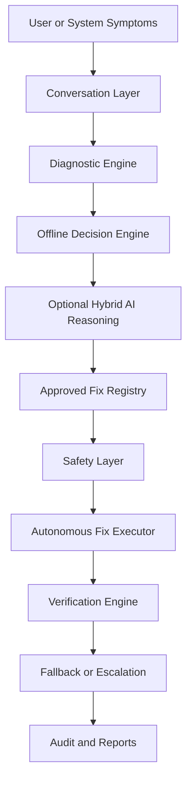

# Architecture

The optional AI layer returns structured reasoning only. It cannot issue commands, change the registry, bypass confirmation/elevation, or execute repairs. The executor maps a finite local registry to reviewed implementations.
